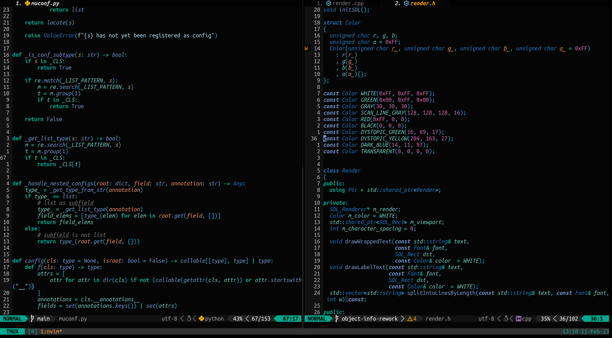
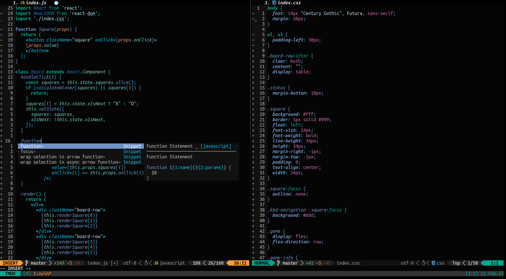
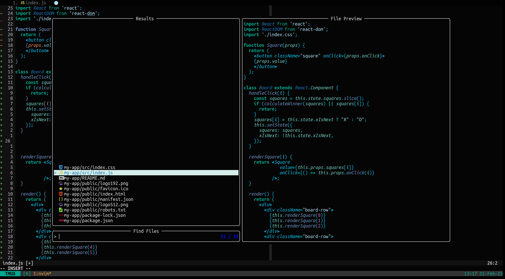

# kit.vim
A dark high contrast colorscheme for vim  inspired by the [Karlsruhe Institute of Technology](https://www.kit.edu/). The dark colors represent my struggle.





## Installation
```vim
" vim-plug or any other plugin manager
Plug 'tadachs/kit.vim'

" set the theme
colorscheme kit

" it comes with a lightline theme
let g:lightline = {'colorscheme': 'kit'}
```

## Configuration
Variables have to be set before `colorscheme kit`
```vim
" disable bold
let g:kit_bold = 0
" disable italics
let g:kit_italic = 0
```
